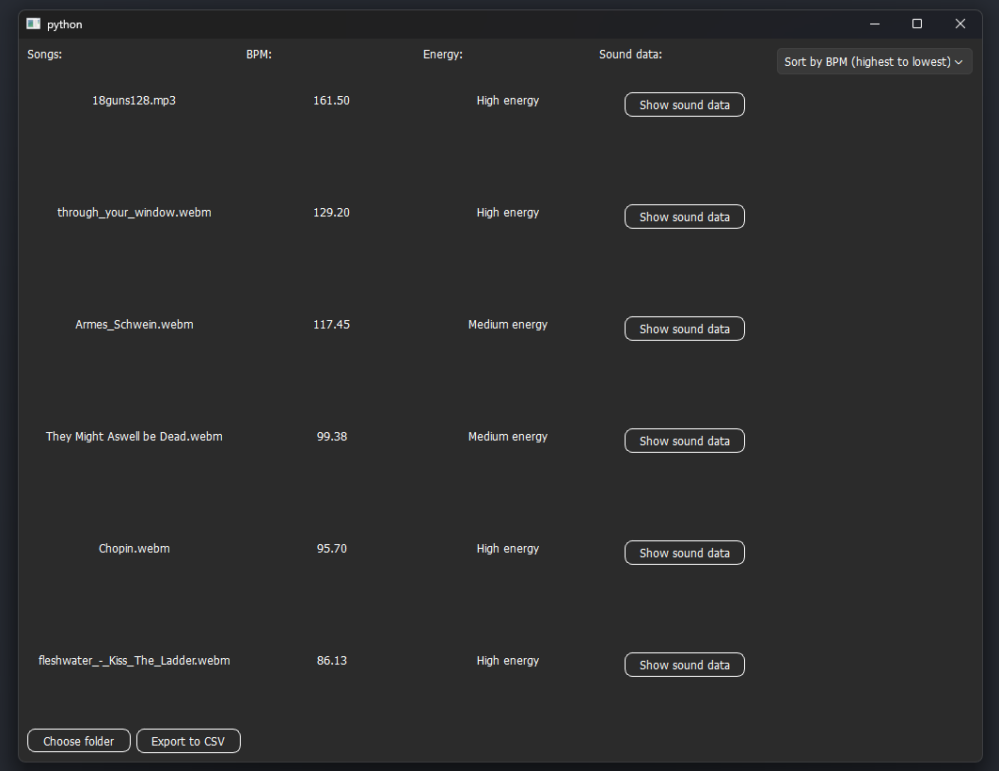
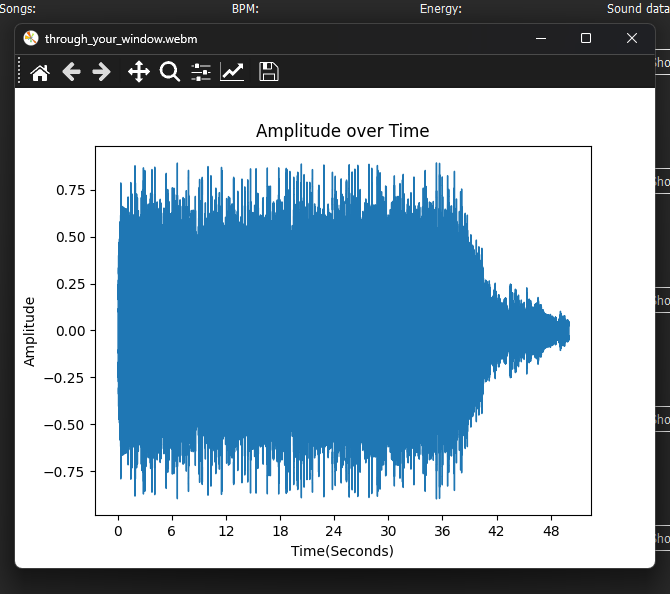

# music-analyzer

A desktop application for analyzing and cataloging music files by tempo (BPM) and energy level. Built as my first project.


## Features

- **Audio Analysis**: Extracts BPM and energy metrics from audio files using librosa
- **Sortable Display**: Sort tracks by BPM or energy level (high to low, low to high)
- **Waveform Visualization**: View amplitude over time for individual tracks
- **CSV Export**: Export analysis results to CSV format
- **Multiple Format Support**: Works with MP3, WAV, FLAC, OGG, and WebM files



## Technologies Used

- **Python 3.13**
- **PyQt6** - GUI framework
- **librosa** - Audio analysis
- **pandas** - Data analysis
- **matplotlib** - Visualization
- **NumPy** - Num operations

## Installation

1. Clone this repository:
```bash
git clone https://github.com/ptakobert/music-analyzer.git
cd music-analyzer
```

2. Install required dependencies:
```bash
pip install -r requirements.txt
```

## Usage

Run the application:
```bash
python musicanalyzer.py
```

1. Click "Choose folder" to select a directory containing audio files
2. The app will analyze all supported audio files and display:
   - Song names
   - BPM (beats per minute)
   - Energy level (Low/Medium/High)
3. Use the dropdown menu to sort by BPM or energy
4. Click "Show sound data" to view waveform visualization
5. Export results to CSV using the "Export to CSV" button

## What I Learned

- Working with audio data and feature extraction
- Building desktop GUIs
- Data manipulation and visualization using pandas and matplotlib respectively
- Using multiple Python libraries in one application

## Future Improvements

- More audio features, as an example a spectrogram or add key detection
- Playlist creation based on similar tracks
- Processing progress indicator

## License

This project is open source and free to use by anyone
